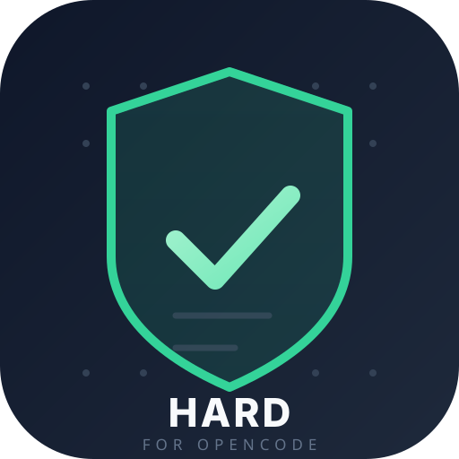

<p align="center">
  
</p>

<p align="center">
  <strong>Hard, non-negotiable constraints for every opencode session.</strong><br>
  Edit rules <em>once</em>. Every session you ever start must acknowledge them — and
  tool calls that would break them are denied.
</p>

<p align="center">
  
  
  
  
  
  
  
</p>

<p align="center">
  <b>Tags:</b> <code>opencode</code> · <code>opencode-plugin</code> · <code>hard-constraints</code> ·
  <code>agent-governance</code> · <code>budget-guard</code> · <code>gdpr</code> · <code>eu-first</code> ·
  <code>privacy-by-default</code> · <code>zero-dependency</code>
</p>

---

Budget, geographical location / jurisdiction, infrastructure requirements and
legal obligations are usually something you re-explain to the agent every single
session — if you remember at all. This project makes them **hard**. You edit them
once in one file; an opencode plugin injects them into every session you ever
start and mechanically denies tool calls that would break them.

The point is to make it impossible for the agent to quietly build something that
ignores your situation: a product that serves the wrong users, infrastructure
housed in the wrong region, or code that trips a law you're bound by.

## 🛡️ How it works

Three enforcement layers, in order of strength:

| Layer | Mechanism | Catches |
| --- | --- | --- |
| 1. **Injection** | `experimental.chat.system.transform` prepends the full rules block to every request's system prompt; `experimental.session.compacting` re-injects it through compaction | The model *knows* the rules at all times |
| 2. **Acknowledgement gate** | Custom `acknowledge_hard_rules` tool. Gated tools (default: `bash`, `edit`, `write`, `create`, `patch`, `webfetch`, `websearch`, `task`) are **denied** until the session has called it with the exact configured phrase | The agent must acknowledge before it can build |
| 3. **Mechanical deny** | `tool.execute.before` throws (and `permission.ask` denies) on: banned tools, forbidden command patterns, forbidden file paths, blocked web hosts; plus `config` rewrites any configured model matching `budget.forbidden_models` | Things that can be checked at the tool-call boundary |

Failure mode is **fail-open but loud**: if the rules file is missing or invalid the
plugin never breaks opencode, but every prompt starts with a warning block saying
enforcement is off.

## 🚀 Quick start

```sh
# 1. Link the plugin into global opencode config + put `hard-rules` on PATH
node ~/hard-rules/bin/hard-rules.mjs install

# 2. Review/edit the rules (they must reflect your real constraints)
hard-rules edit          # creates/edits ~/.config/hard-rules/hard-rules.json
hard-rules validate

# 3. Restart opencode fully (config and plugins load at startup)
```

> Your personal rules live in `~/.config/hard-rules/hard-rules.json`, outside the
> repo. The bundled `rules/hard-rules.json` is a neutral default, so the package
> can be shared without leaking your constraints.

**Install as a real plugin** — once published, add it to `opencode.json` like any
other opencode plugin:

```json
{
  "plugin": ["opencode-hard-rules"]
}
```

or from a local checkout: `"plugin": ["~/hard-rules/plugin/index.mjs"]`.

Then, in any new session, the session must call `acknowledge_hard_rules` with the
exact phrase before it can edit files, run commands, or touch the network.

## 🧰 CLI

```
hard-rules status                 # rules state, counts, ack phrase, gate status
hard-rules validate [file]        # validate against the schema
hard-rules render                 # print the exact prompt block agents see
hard-rules edit [file]            # open rules in $EDITOR (scaffolds if missing)
hard-rules new [file]             # write a fresh template
hard-rules install | uninstall    # link/unlink the global plugin + CLI
```

Environment overrides:

- `HARD_RULES_FILE` — path to the rules JSON (default: `~/.config/hard-rules/hard-rules.json`).
- `HARD_RULES_PLUGIN_PKG` — path to `@opencode-ai/plugin`'s `dist/index.js`, if the
  auto-detected global install isn't where the plugin expects.

> If `hard-rules` isn't on your PATH yet, use `node ~/hard-rules/bin/hard-rules.mjs`.

## 📄 The rules file

Resolved in this order: `$HARD_RULES_FILE` → `~/.config/hard-rules/hard-rules.json`
(your personal file — created by `hard-rules install` / `hard-rules edit`) → the
bundled neutral default `rules/hard-rules.json`. Schema: `rules/rules.schema.json`.
Every section is advisory to the agent except what `enforcement.*` makes mechanical.

| Section | Purpose | Example |
| --- | --- | --- |
| `acknowledgement` | phrase + whether the gate is on | `{ "require": true, "phrase": "..." }` |
| `location` | your country/region/timezone + who you serve | `{ "country": "FI", "region": "eu", "languages_served": ["en","fi"] }` |
| `budget` | currency, monthly/session caps, forbidden vs allowed models | `{ "max_monthly_spend_units": 200, "forbidden_models": ["*opus*"] }` |
| `infra` | allowed regions/providers, data residency, must-haves, forbidden tech | `{ "data_residency": ["eu"], "hosting_region_allowlist": ["eu"] }` |
| `legal` | jurisdictions, laws to comply with, consent/age-gate requirements | `{ "jurisdiction_codes": ["fi","eu"], "must_comply": ["gdpr"] }` |
| `service_level` | latency/uptime targets, design notes | `{ "max_acceptable_latency_ms": 300 }` |
| `enforcement` | the mechanical deny tables | `bash_forbidden_patterns`, `write_forbidden_paths`, `webfetch_forbidden_hosts`, `deny_tools`, `deny_until_acknowledged` |
| `extra_rules` | standing build rules (free text) | `"Never add trackers without consent support"` |

Job-control details:

- `budget.forbidden_models` and `allowed_models` use glob patterns (`*opus*`). If a
  forbidden model is configured in `opencode.json` (default model, small model, or
  any agent model), the plugin **replaces** it with the first allowed model at
  startup; if `allowed_models` is empty, it only flags a warning.
- `enforcement.bash_forbidden_patterns` are regular expressions matched against the
  command string.
- `enforcement.write_forbidden_paths` are globs (`*`, `?`) matched against the
  target path of `edit`/`write`/`create`/`patch`.
- `enforcement.webfetch_forbidden_hosts` are host names (subdomains match too).

## 🧨 Honest limits

Mechanical enforcement can only catch what is checkable at the tool-call boundary —
commands, paths, hosts, tool names, configured models. **Everything else** (that a
provider stays in the EU, that a feature truly meets GDPR, that latency feels fine,
that the accounting stays under budget) is enforced by making the rules part of the
prompt and gating the session behind acknowledgment. That is a strong nudge, not a
proof. Treat free-text rules as binding instructions to the agent and review what it
produces — the plugin makes violation hard, not impossible.

## 📦 Layout

```
bin/hard-rules.mjs        CLI (zero-dependency Node)
lib/rules.mjs             engine: load / validate / evaluate / resolve / model guard
lib/render.mjs            prompt-block rendering
plugin/index.mjs          opencode plugin entry (JSDoc-typed `Plugin`)
plugin/index.d.mts        TypeScript declarations for the plugin entry
plugin/tool-loader.mjs    finds the @opencode-ai/plugin runtime
rules/rules.schema.json   JSON Schema for the rules file
rules/hard-rules.json     bundled neutral default (personal rules live in ~/.config/hard-rules/)
rules/hard-rules.default.json   template for `hard-rules new`
rules/hard-rules.example.json   richer worked example
test/rules.test.mjs       unit + plugin smoke tests (node --test)
assets/                   logo + icon SVG
LICENSE · CHANGELOG.md    MIT license and changelog
```

## 🧪 Tests

```sh
npm test        # or: node --test test/rules.test.mjs  →  24 passing
```

## 🗑️ Uninstall

```sh
hard-rules uninstall      # or: node ~/hard-rules/bin/hard-rules.mjs uninstall
# restart opencode
```

---

<p align="center">
  <br>
  <sub>hard-rules · hard constraints, acknowledged every session</sub>
</p>